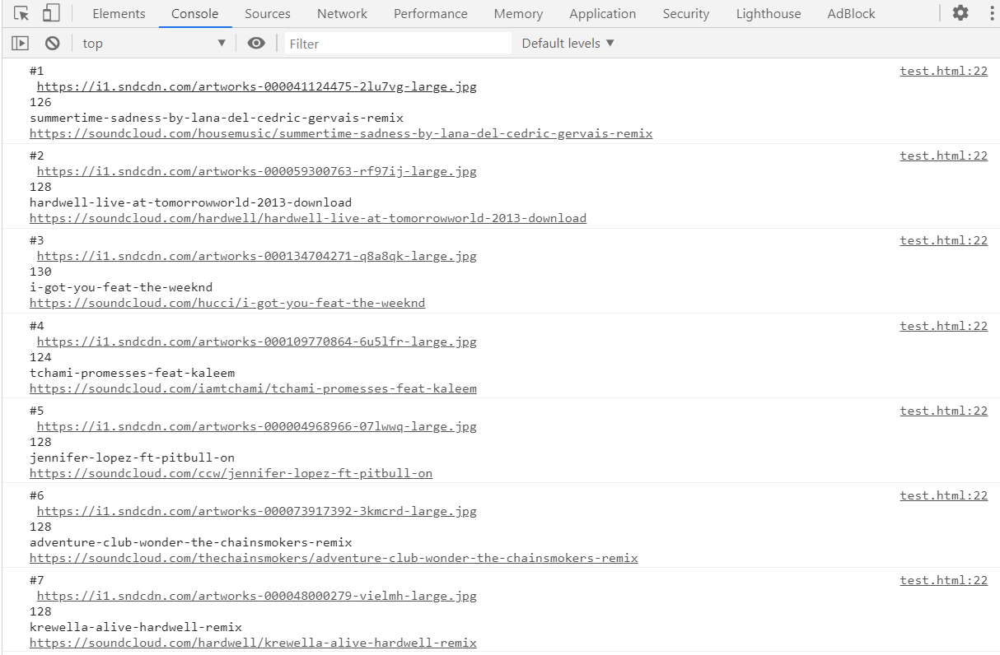
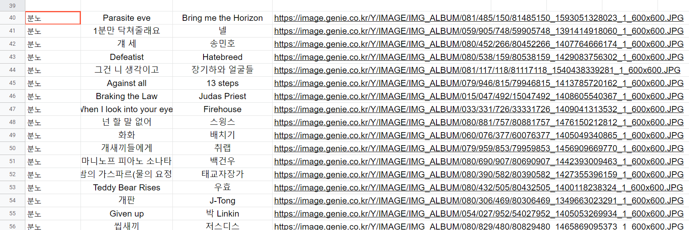
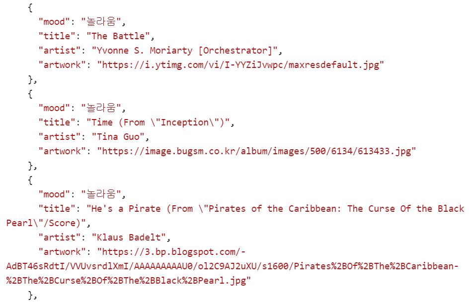
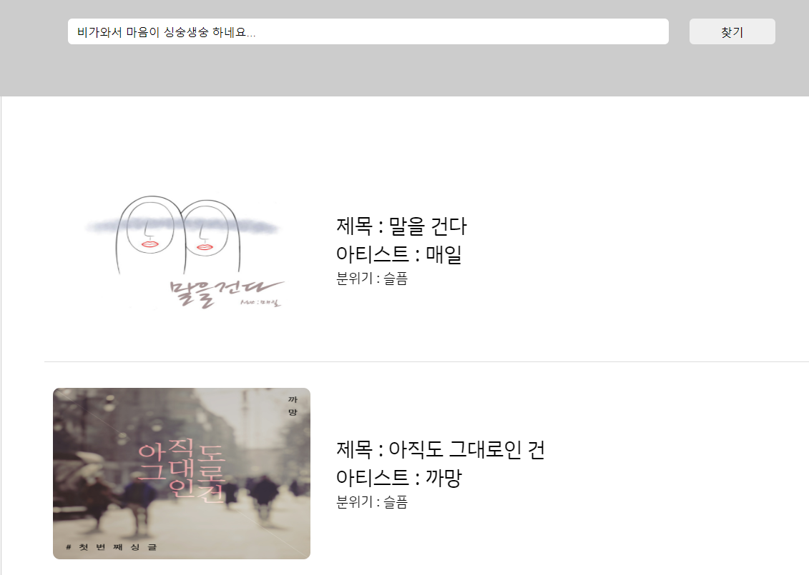

# 💡 Relay Project - 소리올려  
  

### **음악에 대한 정보를 쉽게 접근하고 공유할 수 있는 사이트**

> 노래에 대한 검색이 귀찮으신가요? 궁금한 노래의 검색이 제목이 생각나지 않고 어려우신가요? 이 문제를 해결해주기 위해 제공하는 웹 서비스입니다.

---

## Week2 : A 기능 개발 (자연어 처리)

> A 기능 - 자연어 개발에 대해 기획하기.

**기존 계획**

- 사운드 클라우드의 앨범과 음악 소개를 자연어 처리를 통해 사용자가 노래 검색에 대한 접근과 공유를 쉽게 해준다.
- 자신의 감정을 한 줄로 표현한 코멘트를 바탕으로 노래 검색 Ex) 오늘 비가 오니 우울해요.  

  

---

### 1. 프론트엔드

입력 및 출력 화면 구성

- **index.html**
    - 메인 페이지를 구현하였다.
    - CSS를 Reset 하는 CDN, 데이터를 Fetching 하기 위한 라이브러리인 Axios를 가져왔다.
    - 레이아웃을 잡았다.
- **index.css**
    - index.html 을 마크업 하기 위한 파일
- **script.js**
    - index.html에 연결되어 있다.
- **util/api.js**
    - getAdam( text ) => text의 값의 감정을 분석하는 api의 결과값을 받아오는 함수.  
- **util/Shutterstock.js**
    - getAudio( mood ) => mood로 음악 검색하는 api의 결과값을 받아오는 함수.  


    [Axios 사용법](https://velog.io/@rohkorea86/비동기-비동기에-대해서-차근차근-다루려고-합니다)

---

### 2. 문장 감정 분석

- MS Azure, GCP 등 사용 가능한 감정 분석 API가 많았으나, 한글 감정 분석에 탁월한 **ADAMS.ai** 의 감정 분석 API 사용

### OM Analysis API 감성&감정 분석 API

> 한국어(kor)로 이루어진 자연어 문장에 대해 감성분석(sa), 감정분석(ea) 결과를 제공해주는 API

[https://www.adams.ai/apiPage?OMAnalysis](https://www.adams.ai/apiPage?OMAnalysis)

- POST 요청은 막혀있어 **GET 요청**으로 문장 전달
    - GET 요청 변수 (Request Parameter)
        1. **query** : 분석에 사용할 문장
        2. **type** : 분석 타입 [0: 감성 분석, 1: 감정 분석]
- 주요 반환 값
1. **score**(double) : 0.0~1.0 사이의 숫자로, 결과에 대한 스코어 (1.0에 가까울수록 신뢰도 높음)
2. **label**(string) : 감성 종류 [부정, 중립, 긍정] / 감정 종류 [기쁨, 신뢰, 공포, 기대, 놀라움, 슬픔, 혐오, 분노]
- 분석 예시

    ```json
    {
      "request_id": "0",
      "return_type": "omAnalysis",
      "result": 0,
      "reason": "",
      "return_object": {
        "query": "기분이 그닥이네요",
        "type": "감성분석",
        "score": 0.9982622265815735,
        "label": "부정"
      },
      "result_code": "success"
    }
    ```

### 감정 분석 결과를 이용한 음악 검색 초기 시나리오

- 검색 결과 신뢰도(스코어)가 높으면 사운드 클라우드에 검색할 BPM 범위를 좁게 / 신뢰도 낮으면 BPM 범위 넓게 검색
    - 높은 BPM : 기쁨, 신뢰, 기대, 놀라움
    - 낮은 BPM : 공포, 슬픔, 혐오, 분노

→ 사운드 클라우드 음악 검색을 위한 API 계정 생성이 막혀있음(서비스 중지)

---


### 3. 감정 분석 결과로 음악 검색

1) 계획
    - 사용자의 감정에 부합하는 bpm을 구하고, 계산된 bpm을 바탕으로 [SoundCloud](https://soundcloud.com/)의 음원찾기 API를 활용하여 음원을 찾는다.
    - SoundCloud 음악 검색 API - https://developers.soundcloud.com/docs/api/reference#users

2) 진행
> (120 <= BPM <= 130) 음원을 검색하는 코드  
```javascript
<!DOCTYPE html>
<html lang="en">
<head>
    <meta charset="UTF-8">
    <meta name="viewport" content="width=device-width, initial-scale=1.0">
    <title>Document</title>
</head>
<body>
    <script src="https://connect.soundcloud.com/sdk/sdk-3.3.2.js"></script>
    <script>

    SC.initialize({
      client_id: '6150dd7ff5335b40c8d9faaf7e7c4644'
    });

    SC.get('/tracks', {
        bpm: { from: 120, to: 130 }
    }).then(function(tracks) {
        tracks.forEach((track, idx) => {
            console.log(`#${idx + 1}\n ${track.artwork_url}\n${track.bpm}\n${track.permalink}\n${track.permalink_url}`);
        });
    });

    </script>  
</body>
</html>
```  

> Console 출력 화면 - 오픈 API를 사용하여 120 이상 130 이하의 bpm을 가진 음원들의 이미지, bpm, 제목, 재생링크 등을 가져왔다.  



3) 문제점
    - API를 사용하기 위해서 SoundCloud 에 App을 등록하는 절차가 필수인데, 해당 API에 대한 요청이 폭주하여 App 등록이 일시적으로 막혔고 따라서 새로운 API KEY를 발급받을 수 없었다. 위의 코드는 github에서 우연히 발견한 API KEY를 사용(도용)하여 간단하게 결과를 출력했지만, 남은 relay-project 기간 동안 계속 사용하기에는 부적절하다고 판단했다.


4) 대안
    - 자체적으로 음원DB를 만들어 사용하기로 결정.
    - 추가적으로 원활한 검색을 위해 bpm 이 아닌 사용자의 '무드'를 음원검색 요청변수로 변경했다.

> 음원DB




> JSON 형식으로 변환



5) 결과

> '비가와서 마음이 싱숭생숭 하네요...' 를 검색하여 얻은 음원 결과



6) 개선(주말)
    - shutterstock developers 에 성공적으로 App을 등록 후 API KEY 발급에 성공.
    - fakeDB를 사용하는 대신 mood를 요청 변수로 보낸 후 음원 결과를 반환 받음.

> 순서도


